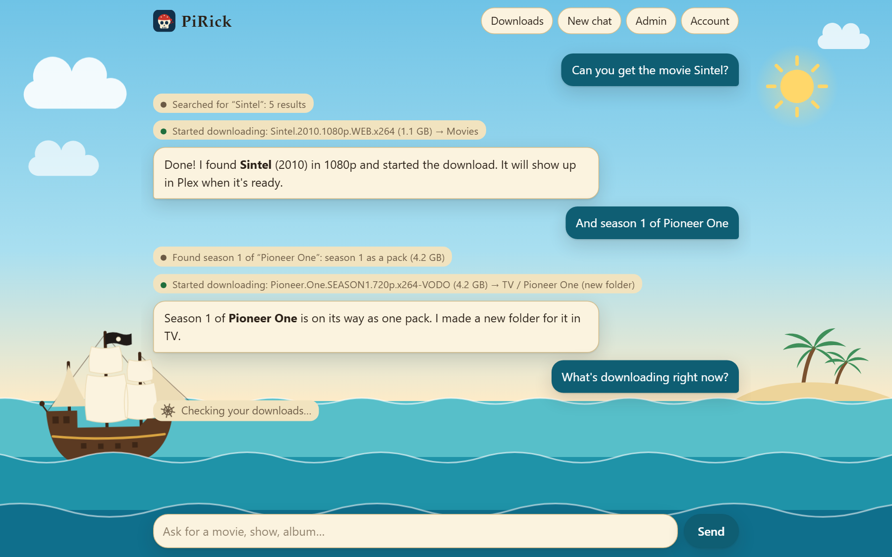
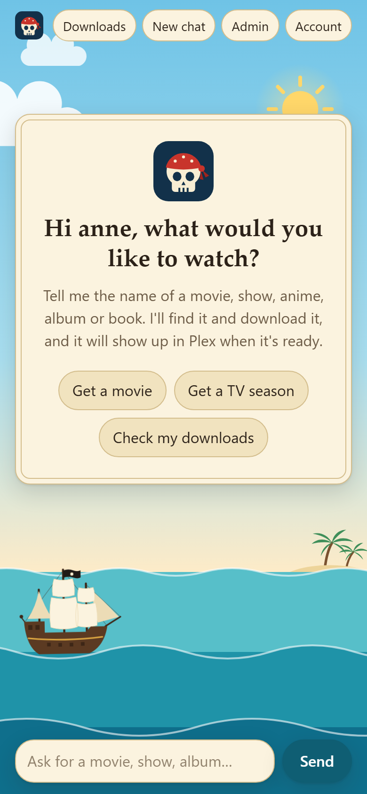
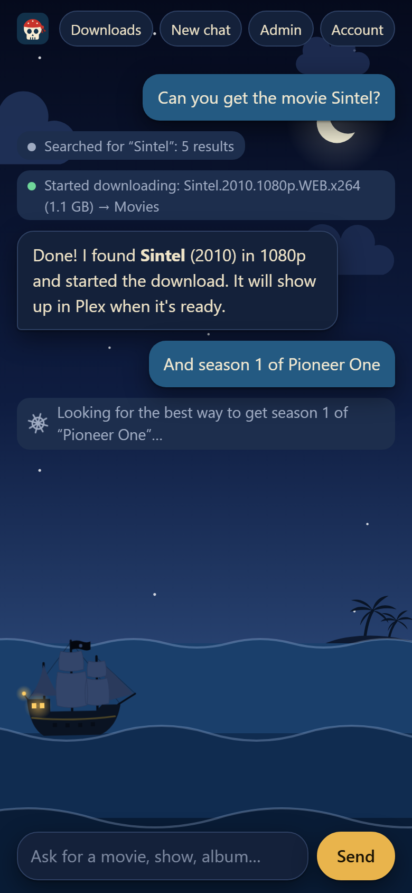
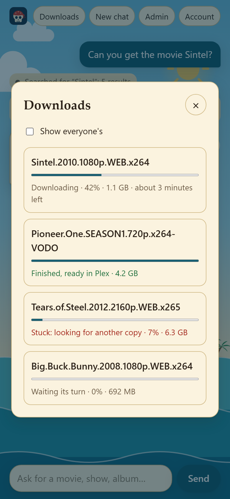
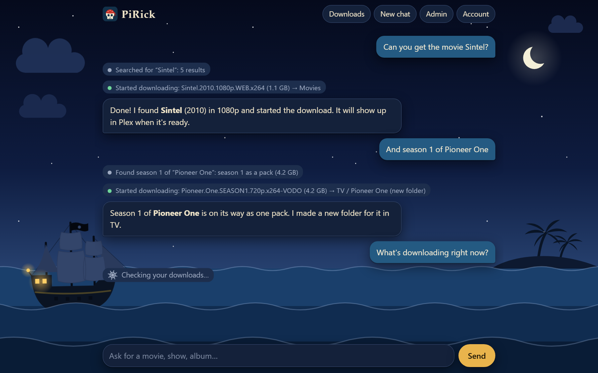
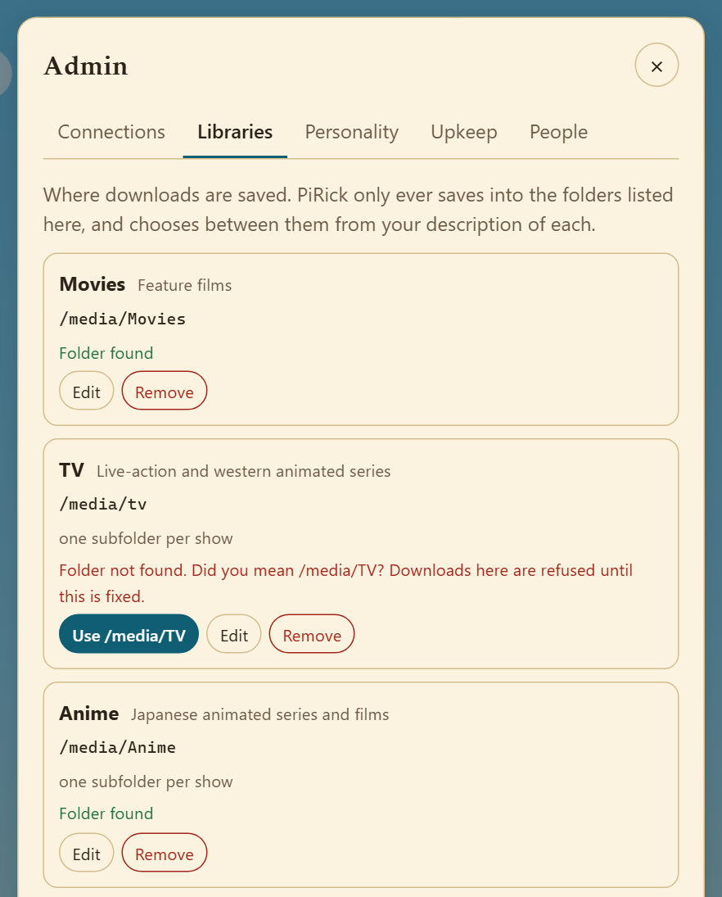

<p align="center">
  
</p>

<h1 align="center">PiRick</h1>

PiRick is a small web app that lets people ask for something to watch in plain language. An AI model (running in Ollama) searches Jackett, picks a good copy, and adds it to qBittorrent. When the download finishes it appears in Plex. Nobody has to learn Jackett.

Only people with an account can use it. Accounts are created by an admin.




## What it looks like

PiRick works the same on a phone as on a desktop. Everyone gets the chat and a **Downloads** panel that says in plain words how each download is doing. Admins also get the **Admin** screen.

<p align="center">
  
  
  
</p>

Out of the box the look follows the device's light or dark setting. Dark mode is the same scene at night:



The waves, clouds and ship move gently. This is done in CSS alone, so an open tab costs very little, and it stays still on a device set to reduce motion.

Each person can pick another theme, and have it light or dark whatever their device says: see "Themes and personalities".

## Quick start

You need Docker, plus Ollama, Jackett and qBittorrent already running somewhere PiRick can reach.

1. Put `docker-compose.yml` and `.env.example` from this repository in a folder (clone it, or download just those two files). Copy the example settings and fill them in:

   ```
   cp .env.example .env
   ```

   At minimum set `JACKETT_API_KEY`, `QBIT_USERNAME`, `QBIT_PASSWORD`, and check the three URLs and `OLLAMA_MODEL`.

2. Start it. This downloads the ready-made image; nothing is built on your machine:

   ```
   docker compose up -d
   ```

3. Get the admin password. If you left `ADMIN_PASSWORD` empty, PiRick made one and printed it once:

   ```
   docker compose logs pirick
   ```

4. Open `http://<this-machine>:8787`, sign in as `admin`, and open **Admin**. The **Connections** section shows whether Ollama, Jackett and qBittorrent are reachable, with the reason if not. Fix `.env` and run `docker compose up -d` again until all three are green. Plex is listed there too. It is optional, and reads "Not connected" until you set it up: see "Connecting Plex".

5. Open **Admin > Libraries** and add the folders downloads should go into, for example Movies, TV and Anime. PiRick refuses to download until at least one exists. See "Libraries" below.

6. Change your password under **Account**, then add the people who should have access under **Admin > People**.

## Reaching your other services

The URLs in `.env` are used from inside the PiRick container.

| Where the service runs | Use this address |
|---|---|
| On the Docker host, with its port published | `http://host.docker.internal:<port>` |
| In a container on the same Docker network as PiRick | `http://<container-name>:<port>` (add that network to `docker-compose.yml`) |
| On another machine | `http://<ip-or-hostname>:<port>` |

On Linux, Ollama listens only on `127.0.0.1` by default, where containers cannot reach it. Ollama has no login of its own, so anyone who can reach its port can use it. If it runs on the same machine as PiRick, set `OLLAMA_HOST` for the Ollama service to the Docker bridge address (usually `172.17.0.1`), so only containers on that machine can reach it. If it runs on another machine it needs `OLLAMA_HOST=0.0.0.0`; add a firewall rule there that lets only the PiRick machine reach port 11434.

## The image: updates, versions and stack managers

`docker-compose.yml` runs `ghcr.io/pirick-dev/pirick:latest`. GitHub builds that image from the `main` branch, for x86-64 and ARM64, each time something is merged into it.

- **Updating.** `docker compose pull`, then `docker compose up -d`. Accounts, libraries and chat history live in the `pirick-data` volume and are kept.
- **Staying on one build.** Every build is also tagged with its commit, for example `ghcr.io/pirick-dev/pirick:sha-1a2b3c4`. Put such a tag in `image:` to stop getting updates, or to go back to an earlier build. The tags are listed under **Packages** on the repository's page, and the foot of **Admin > Connections** shows the one you are running and when it was built.
- **Dockge, Portainer and other stack managers.** Paste `docker-compose.yml` in as the stack and put your settings in the stack's `.env` (Dockge has a box for it next to the compose file). A new instance starts with an empty database: its first-run admin password is in the stack's log, and libraries and people have to be added again.
- **Your own build.** `docker compose -f docker-compose.yml -f docker-compose.build.yml up -d --build` builds from this folder instead of downloading. To run your build on another machine, push it to a registry of your own and change `image:` to match. With a private registry, the Docker client that runs Compose has to be logged in. Dockge runs its own client inside its container, so a login on the host does not count and the pull fails with `no basic auth credentials`: run `docker exec -it <dockge container> docker login <registry>`, and again whenever that container is recreated.

## Libraries: where downloads go

A download shows up in Plex because qBittorrent saves it inside a folder that a Plex library watches. You tell PiRick which folders those are under **Admin > Libraries**. PiRick only ever saves into a folder listed there. It never invents a folder or a qBittorrent category, and until at least one library exists it refuses to download. None of this needs a connection to Plex; "Connecting Plex" says what one adds.

Each library has:

| Field | Example | What it is for |
|---|---|---|
| Name | `Anime` | What the assistant and the chat call it |
| What goes here | `Japanese animated series and films` | How the assistant decides between libraries. Be specific where two overlap, such as TV and Anime. |
| Folder | `/media/Anime` | The path exactly as qBittorrent sees it, capitals included. If qBittorrent runs in a container, this is the path inside that container. |
| Subfolder per show | on | Saves into `/media/Anime/<Show name>/` instead of straight into the folder. Usual for TV and anime, off for films. |
| qBittorrent category | (empty) | Optional. Nothing is sent to qBittorrent unless you fill this in. |

A typical setup is three libraries: Movies (no subfolders), TV and Anime (a subfolder per show).

**Folder checks.** The Folder box suggests real folders as you type, and each library shows whether its folder was found. A folder that differs only in capitals (`/media/tv` when the real one is `/media/TV`) is flagged with a one-click fix. If a library's folder does not exist, downloads into it are refused, because qBittorrent would otherwise create a new, wrongly named folder. These checks need qBittorrent 5; with an older version the row says "Could not check" and the path is used as typed.

<p align="center">
   Libraries with three libraries. Movies and Anime say Folder found. TV points at /media/tv, is flagged as not found, and has a button to use /media/TV.">
</p>

**One folder per show.** With subfolders on, the assistant names the show and PiRick decides the folder:

- If a folder for that show already exists, it is reused with its own spelling. Capitals, punctuation and a trailing year are ignored when comparing, so a request for "pioneer one" goes into an existing `Pioneer One (2010)`.
- If no folder matches but one looks similar (an existing `Les Vampires` when the assistant says "The Vampires"), PiRick asks the assistant whether it is the same show before creating anything.
- Otherwise a new folder is created, and the chat says `(new folder)` so a wrong guess is easy to spot.

This works well for a show's later seasons and for alternative titles the assistant recognises. It cannot know that two completely different names are the same show. When that happens the chat says `(new folder)`, and you can move the download to the right folder in qBittorrent.

Every download PiRick adds is tagged `pirick` and `pirick-<username>` in qBittorrent, so you can see who asked for what. If someone asks for something that is already in qBittorrent and was not added by PiRick, it only gets the `pirick-<username>` tag. It shows in that person's downloads, but PiRick does not treat it as its own: upkeep leaves it alone, and it is not listed under **Show everyone's**.

## How searching works

Indexers match release names literally, and they are not careful with numbers. Asking for the 1925 film "Seven Chances" as "7 Chances" returns episodes numbered 07 of other things and not the film, which is released as `Seven.Chances.1925…`. PiRick does three things about that, without relying on the AI model:

- **Other spellings.** If a search finds nothing suitable, PiRick tries the title's other common spellings: digits as words and words as digits (`7 chances` and `seven chances`), a sequel number as a roman numeral (`Part 2` and `Part II`), and `&` as `and`. The chat line then reads `Searched for “7 chances” (found as “seven chances”)`.
- **Only relevant results.** Results are kept only if the release name contains the title that was asked for, with its words together and in order. When a year is given, copies from that year win. If nothing clearly matches, the model is told so and warned not to pick from what came back.
- **Extra words dropped.** Release names do not contain cast or crew. The model is told to search by title and year alone; if a search with extra words after the year still finds nothing, PiRick retries without them.

Searches run one at a time, and a further spelling is only tried when the one before was not enough. This matters when indexers sit behind a Cloudflare solver such as FlareSolverr: each search then takes 10 to 20 seconds, and several sent at once come back with far fewer results, sometimes none. If your indexers are fast and direct, `JACKETT_SEARCHES_AT_ONCE` lets the whole-show planner look at several seasons together.

Two more things to know about Jackett:

- **It caches empty answers.** When an indexer hiccups and returns nothing, Jackett remembers that for the same search for about half an hour. PiRick recognises such an answer because it arrives instantly, and asks again in different capitals, which Jackett treats as a new search. `JACKETT_RETRY_CACHED_EMPTY=false` turns this off.
- **It hides failing indexers.** Jackett answers with whatever worked. PiRick logs a warning when an indexer reports an error, and **Admin > Connections** names the ones failing in recent searches.

An indexer can also stop answering for a while if it is searched very often in a short time. Jackett then reports it as working with no results, and nothing downstream can tell the difference. If things that certainly exist are suddenly "not found", wait a while and try again.

## Whole shows, seasons and episodes

For anything that is a TV show or anime, PiRick works out the best way to get it and does not leave that choice to the AI model. Asked for a whole show, it prefers, in this order:

1. One complete pack.
2. Packs covering several seasons, then one pack per season.
3. Single episodes, the best copy of each, for any season that has no usable pack.

A copy with at least 3 seeders beats one with fewer, then the requested quality (1080p unless the person asks otherwise), then the number of seeders. So a complete pack with 2 seeders loses to healthy season packs, and a pack with no seeders is never chosen. Anything over `MAX_TORRENT_SIZE_GB` is skipped, which lets a huge complete pack fall back to season packs.

Asked for one season, PiRick takes that season's pack, or its single episodes if there is no good pack. Asked for one episode, it takes the best copy of that episode and nothing else.

Everything for one show goes into the same folder. One request may start at most 200 downloads; beyond that PiRick asks the person to choose seasons.

Things to know:

- PiRick has no episode guide. If a season should have ten episodes and the indexers only have eight as single files, it gets the eight and cannot tell that two are missing.
- When two different shows share a name (say a 1963 and a 2005 series), PiRick does not mix them: it asks which one is meant.
- Release names that cannot be read (unusual naming) are left out of these plans.

## Upkeep: finished and stuck downloads

PiRick looks after its own downloads: everything in qBittorrent tagged `pirick`. It does two things.

**Finished downloads.** Every minute PiRick looks for downloads that have just finished. For each one it leaves a note for the person who asked, which they get the next time they open PiRick: `“Wrenfield Cross (S03E01)” has finished downloading.` Episodes of one show that finish before the note is read are gathered into one note. With Plex connected, PiRick also asks Plex to pick the download up straight away, and the note says so. This part is always on.

**Stuck downloads.** Every 10 minutes PiRick also checks for downloads that have stopped, including ones added before this feature existed. A download is **stuck** when it should be making progress and has not grown for the time set under **Admin > Upkeep** (6 hours by default). Time spent paused, queued or being checked does not count.

When a download is stuck, PiRick looks for another copy of the same thing:

| Stuck item | Replacement |
|---|---|
| One episode | Another copy of that episode |
| A season pack | Another pack of that season, otherwise its single episodes |
| A complete pack | Another complete pack, otherwise season packs, otherwise episodes |
| A film | Another copy with the same title and year (never a cinema recording) |
| Anything else (music, books, unreadable names) | None: it is only flagged |

The replacement goes into the same folder with the same category and tags. Only once qBittorrent has accepted it is the stuck torrent removed, together with its partial files. A copy that was already tried is never picked again. If no other copy exists, the stuck download is left alone and looked for again once a day. Each item is replaced at most three times, and at most five items are replaced per check.

This follows fixed rules; the AI model is not involved, because it runs unattended.

**What people see.** A stuck download reads "Stuck: looking for another copy" in the Downloads panel. When the person who asked for it next opens PiRick, the chat shows what was done as plain status lines, followed by a short summary in PiRick's own voice (using the personality, if one is set). The status lines are written by PiRick and are the reliable record. **Admin > Upkeep** lists the last 50 actions and has a **Check now** button and an off switch. The switch is for replacing stuck downloads; finished downloads are noticed either way.

Things to know:

- A dead pack replaced by single episodes may end up incomplete: only episodes that exist as single files can be fetched. The activity entry says "all that could be found" when this happens.
- qBittorrent's own queue limits how many downloads are active at once (three by default). Dead downloads holding those slots keep the rest waiting until upkeep replaces them. Turning on "Do not count slow torrents in these limits" in qBittorrent's BitTorrent options, or lowering the hours here, clears a backlog faster.
- Torrents in an error state in qBittorrent (missing files, disk problems) are flagged but not replaced, since another copy would not fix them.
- A finish is noticed within about a minute, not at once. A download that was already finished the first time PiRick saw it (after an update, say) is old news and gets no note.

## Connecting Plex

PiRick works without talking to Plex. Connecting it is optional and fixes two things:

- **"It's finished" becomes true sooner.** Plex notices new files on its own schedule, which can be hours. With Plex connected, PiRick asks it to look at a download's folder the moment the download finishes.
- **Nothing is fetched twice.** Without Plex, PiRick only knows what is in qBittorrent. With it, PiRick checks what is already in your Plex libraries, however it got there, before fetching anything.

**Setting it up.** Add two lines to `.env` and run `docker compose up -d`:

```
PLEX_URL=http://host.docker.internal:32400
PLEX_TOKEN=your-token
```

`PLEX_URL` is the address of the Plex server as seen from the PiRick container, with nothing after the port (see "Reaching your other services"). `PLEX_TOKEN` is your Plex access token: in Plex's web app, open any film or episode, choose **Get Info** from its `⋯` menu, then **View XML**, and copy what follows `X-Plex-Token=` in the address of the page that opens. Plex describes this under [Finding an authentication token](https://support.plex.tv/articles/204059436-finding-an-authentication-token-x-plex-token/). **Admin > Connections** then shows the server's name and how many libraries it has.

**Treat the token like a password.** It gives full control of your Plex server. PiRick only reads what is in the libraries and asks for scans; it never changes or removes anything in Plex. The token is sent in a request header, never in an address, and is never logged, shown in the Admin screen or given to the AI model.

**Matching libraries.** qBittorrent and Plex usually see one folder under two paths, for example `/media/TV` and `/data/TV`. PiRick takes each of its libraries to be the Plex folder whose path ends the same way. **Admin > Libraries** shows the match under each library, with a list to pick another Plex folder or **Not in Plex**. A library with no match works as before; Plex is just not told about its downloads.

**When a download finishes**, PiRick asks Plex to scan that one folder: the show's own folder, or the film's. It is one request however many episodes finished together. If Plex cannot be reached, PiRick tries again on its next few looks, then gives up and says only that the download finished. In the Downloads panel a download reads "Finished, ready in Plex" once Plex has been asked, and "Finished" otherwise.

**What you already have.** The assistant is told what Plex has along with what it finds:

- **Films.** A search result for a film Plex already has (same title, year within one) is marked as such. If the assistant tries to download it anyway, PiRick stops it and has it ask the person first.
- **Shows.** Asked for a whole show, PiRick leaves out the seasons and episodes Plex has and fetches the rest. Asked for one season that Plex has some of, it says how many episodes are there and asks before fetching. An episode that is there is reported as there.
- **"Do we have…?"** is answered from Plex and never starts a download by itself. If it is not there, PiRick says so and asks whether to get it.

Things to know:

- Plex knows which episodes it has, not how many a season should have. PiRick reports the number and leaves the judgement to you. For a whole show it takes every season before the last one you have to be complete, and looks for single episodes missing from that last one.
- Films and shows are matched by title and year. Capitals, punctuation and numbers written as words do not matter, but something filed in Plex under a quite different name is not recognised and may be fetched again.
- Music and books are not checked against Plex.
- If Plex is down when someone asks for something, PiRick carries on as it does without Plex.
- Use an `http://` address on your own network. If Plex is set to require secure connections (Settings > Network), that is refused: set it to "Preferred".

## Themes and personalities

Each person chooses how PiRick looks and sounds, under **Account**. A choice applies at once and belongs to the account, so it follows the person to every device they sign in on.

**Themes** are built into PiRick:

| Theme | What it is |
|---|---|
| The sea | The ship at anchor. What everyone starts with. |
| Plain | No picture, quiet colours. For anyone who finds the scene distracting. |

Every theme comes in light and dark. "Match my device" follows the device's own setting, as PiRick always has; "Light" and "Dark" hold it one way. The sign-in page shows the look last used in that browser.

**Personalities** are a list an admin keeps under **Admin > Personalities**. Each entry has a name, which is what people see, and a description of how PiRick should sound, which is what the AI model is given. The list starts with four: a pirate captain, a posh butler, a grumpy video-store clerk and an over-excited film buff. An admin can change or remove them and add up to 20 in all.

- An admin picks what people hear until they choose for themselves: one of the entries, or plain PiRick.
- Each person can pick any entry instead, or "Plain PiRick" for no personality at all. It applies from their next message.
- Removing an entry puts whoever had chosen it back on the usual one.
- A PiRick that had a single personality before this list existed keeps it as an entry called "House voice", set as what people hear, so nobody notices a change.

A personality changes the assistant's voice, not what it does: the rules about searching, choosing and reporting stay in force. The grey status lines in the chat and PiRick's own error messages are never affected.

## HTTPS and your reverse proxy

PiRick serves plain HTTP on port 8080 inside the container (8787 on the host). Put your reverse proxy in front of it for HTTPS. Without HTTPS, passwords cross the network unencrypted.

- Keep `TRUST_PROXY=1` when exactly one proxy sits in front of PiRick. PiRick then uses the visitor's real address for login lockouts and marks the session cookie `Secure`. Use `2` for two proxies (for example Cloudflare in front of your own proxy). Use `false` if people connect directly with no proxy.
- The proxy must pass `X-Forwarded-For` and `X-Forwarded-Proto`. Nginx Proxy Manager, Traefik and Caddy do this by default.
- If the proxy is on the same machine, change the port line in `docker-compose.yml` to `"127.0.0.1:8787:8080"` so PiRick cannot be reached around the proxy.
- A number tells PiRick to believe whoever connects to it. That is only right when the proxy is the only thing that can reach PiRick's port. If the port is open to your network as well (the proxy is on another machine, say), anyone who connects to it directly can claim to be any address, and the login lockouts stop working. Set `TRUST_PROXY` to the proxy's own address instead, such as `TRUST_PROXY=10.0.0.5`, or to a subnet such as `172.16.0.0/12`. PiRick then ignores what anyone else claims. Do not use `true`: it believes any address a visitor claims, even through a proxy.
- Replies are streamed. PiRick asks nginx not to buffer them and sends a heartbeat every 15 seconds, so default proxy timeouts are fine.

Caddy:

```
pirick.example.com {
    reverse_proxy 127.0.0.1:8787 {
        flush_interval -1
    }
}
```

nginx:

```
location / {
    proxy_pass http://127.0.0.1:8787;
    proxy_set_header Host $host;
    proxy_set_header X-Forwarded-For $proxy_add_x_forwarded_for;
    proxy_set_header X-Forwarded-Proto $scheme;
}
```

## Choosing a model

`OLLAMA_MODEL` must support tool calling: `ollama show <model>` lists `tools` under Capabilities. The default is `gemma4:e4b`, because it runs in under 5 GB of graphics memory. If you have 12 GB or more, `gemma4:12b` does the job better: set `OLLAMA_MODEL=gemma4:12b`.

What the comparison found (October 2026, Ollama 0.35.1, a 16 GB Radeon RX 6950 XT; see "Comparing models" for how it works):

| Model | Did the right thing | Critical failures | Typical wait | Graphics memory | In short |
|---|---|---|---|---|---|
| `gemma4:12b` | 96% | none in 205 | 6.7 s | 8.9 GB | The best that fits a 16 GB card. It often announces a download before making it, which PiRick catches at the cost of a few seconds. |
| `gemma4:e4b` | 90% | 1 in 205 | 8.2 s | 4.5 GB | The default. Weaker when a title is unfamiliar or a judgement is called for, and once took an advert for the film. |
| `ornith:9b` | 88% | 2 in 205 | 5.8 s | 5.3 GB | Steadiest speed, but twice picked one of two shows with the same name without asking. |
| `granite4.1:8b` | 80% | 1 in 205 | 2.7 s | 6.2 GB | Fastest. Lists options with technical details, and once said it had cancelled a download, which PiRick cannot do. |
| `qwen3.8:27b` | 95% | none in 82 | 25 s | 12.8 GB and part on the CPU | Nearly as good as `gemma4:12b`, at close to four times the wait and nearly all of the graphics card. |

Four things held across models:

- **Leave thinking on.** `OLLAMA_THINK=false` cuts the wait by more than half but costs accuracy: `gemma4:e4b` fell from 90% to 72% and `gemma4:12b` from 96% to 88%. Without thinking, `gemma4:12b` also said it had started two seasons when it had fetched one.
- **Avoid "abliterated" builds.** The abliterated `gemma4:e4b` scored 76% against 90% for the normal build. It took the advert for the film both times it was offered, and claimed to have cancelled a download.
- **Bigger is not better by itself.** A 24B Mistral scored 77% at 22 seconds a request.
- **What is already in Plex is the easy part.** With Plex connected, every model in the table got every request about things already there right, "do we have it?" included. PiRick works out what Plex has and what to leave out; the model only has to say so.

Small models make mistakes, most often saying "I've started the download" without doing it. PiRick guards against that: a reply is only shown once it matches what actually happened, and the model is sent back to finish the job if it does not. The grey status lines in the chat ("Searched for…", "Found…", "Started downloading…") are written by PiRick, not the model, and always reflect what really happened. Which copies to fetch for a show, what Plex already has, and whether a stuck download gets replaced, are also decided by PiRick's own rules, not by the model.

If a model behaves badly, set `LOG_LEVEL=debug` to see each step it takes in `docker compose logs pirick`, or try a larger model.

### Comparing models

`npm run bench` puts Ollama models through PiRick's own job and ranks them, so a new model can be judged on more than a hunch. It needs Node.js on a machine that can reach Ollama; it is not part of the Docker image.

```
npm run bench -- --models gemma4:e4b,gemma4:12b     # every scenario twice for each model
npm run bench -- --models gemma4:12b --passes 5     # carry on up to five passes
npm run bench -- --models gemma4:12b --think off    # the same model with thinking switched off
npm run bench -- --report                           # rebuild the report from the saved runs
```

Each run builds a throwaway PiRick in memory, with the real prompt, tools and reply check, and sends it one of 41 requests: films and shows asked for plainly, vaguely, misspelt or in Spanish; requests where it should ask first; things that are already in Plex, and questions about whether they are; downloads that fail; a search result that is an advert and one that carries instructions for the AI; a personality to keep up. Jackett, qBittorrent and Plex are stand-ins inside the benchmark, which is never told where the real ones are, so nothing is searched for or downloaded. A run is judged by what happened, such as which release reached the stand-in qBittorrent and in which folder, not by a second AI's opinion of the wording. A model that checks before downloading ("shall I get the 1080p one?") is told yes and judged on what it does next: checking first is counted, but only failing to follow through is a failure.

Results go to `bench/results/main/`: `report.md` ranks the models and `transcripts/` holds every conversation. For each model the report gives how often it did the right thing, its critical failures (the wrong thing downloaded, a download without asking when it should have asked or when it was only asked a question, a false "it's downloading"), how often PiRick had to correct it behind the scenes, how long a request took, how many searches it made, and how much memory it used.

Things to know:

- Runs are saved as they finish. Stop it whenever you like; the same command carries on where it was. To play scenarios again although they are saved, for example after changing what PiRick tells the model, add `--scenarios <id>,<id> --again`; the newer runs replace the saved ones in the report.
- It reads `OLLAMA_URL` and `OLLAMA_NUM_CTX` from `.env`. Models must already be pulled.
- While it runs it keeps Ollama busy and loads one model after another, so a live PiRick sharing that Ollama will be slow. Runs during which another model got loaded are repeated.
- Speed is the model's alone, because the stand-in indexer answers instantly. On a real setup add the time of each search.
- On a machine with two graphics adapters, Ollama can load a model onto the weaker one, where it runs dozens of times slower. The benchmark refuses a model whose loading takes hardly any dedicated graphics memory; `--force` runs it anyway.
- Scenarios, their checks and the stand-in indexer's contents are in `bench/scenarios.js` and `bench/corpus.js`. `npm test` proves every scenario can be passed and that known mistakes are caught.

## Settings

Connection settings are environment variables in `.env`. Restart with `docker compose up -d` after changing them. Libraries, personalities and upkeep are set in the Admin screen instead and take effect immediately.

| Variable | What it does | Default |
|---|---|---|
| `ADMIN_USERNAME`, `ADMIN_PASSWORD` | The first admin account. Used only when PiRick has no users yet. | `admin`, random |
| `OLLAMA_URL` | Ollama address | `http://host.docker.internal:11434` |
| `OLLAMA_MODEL` | Model to use; must support tools | `gemma4:e4b` |
| `OLLAMA_NUM_CTX` | Context window in tokens | `8192` |
| `OLLAMA_THINK` | Whether a thinking model reasons before answering: `false`, `true`, or `low`/`medium`/`high` for models that take a level | the model's default |
| `OLLAMA_KEEP_ALIVE` | How long Ollama keeps the model loaded, e.g. `30m` | Ollama's default |
| `OLLAMA_API_KEY` | Bearer token, if your Ollama needs one | none |
| `OLLAMA_TIMEOUT_SECONDS` | Give up on a reply after this long | `300` |
| `JACKETT_URL` | Jackett address | `http://host.docker.internal:9117` |
| `JACKETT_API_KEY` | From the top right of the Jackett dashboard | none (required) |
| `JACKETT_INDEXER` | `all`, or one indexer's id | `all` |
| `JACKETT_TIMEOUT_SECONDS` | Give up on a search after this long | `60` |
| `JACKETT_SEARCHES_AT_ONCE` | How many searches the whole-show planner may run together. Keep at 1 if indexers use FlareSolverr. | `1` |
| `JACKETT_RETRY_CACHED_EMPTY` | Ask again when Jackett instantly replays an empty answer | `true` |
| `SEARCH_RESULT_LIMIT` | How many results the model gets to choose from | `15` |
| `QBIT_URL` | qBittorrent Web UI address | `http://host.docker.internal:8080` |
| `QBIT_USERNAME`, `QBIT_PASSWORD` | qBittorrent Web UI login | none |
| `MAX_TORRENT_SIZE_GB` | Refuse anything larger; `0` = no limit | `0` |
| `PLEX_URL` | Plex server address, with nothing after the port. Optional: see "Connecting Plex" | none |
| `PLEX_TOKEN` | Plex access token. Needed together with `PLEX_URL` | none |
| `TRUST_PROXY` | Number of reverse proxies in front of PiRick, the proxy's address, or `false` | `false` (`1` in `.env.example`) |
| `COOKIE_SECURE` | `auto`, `true` or `false` | `auto` |
| `SESSION_IDLE_DAYS`, `SESSION_MAX_DAYS` | Sign out after this long unused / regardless | `7`, `30` |
| `LOG_LEVEL` | `debug`, `info`, `warn` or `error` | `info` |

## Security

What is in place:

- Passwords are hashed with scrypt and a per-user salt. They are never stored or logged.
- Sessions are random tokens in an `HttpOnly`, `SameSite=Lax` cookie (`Secure` over HTTPS). Only a hash of the token is stored. Sessions end after 7 idle days or 30 days in total, and when the password changes.
- Login attempts are limited: 5 per address and username, 20 per username, 30 per address, every 15 minutes.
- Requests that change anything must come from PiRick's own pages (custom header plus the browser's same-origin signal), which blocks cross-site request forgery.
- A strict Content Security Policy allows no inline or third-party scripts. Model replies and torrent titles are inserted as text, never as HTML.
- The model never sees or supplies links, magnet addresses, folder paths, the Jackett key or the Plex token. It can only pick from results Jackett returned to that same person, by id, and only save into a library an admin defined. Show names it supplies are cleaned so they cannot point outside the library's folder.
- The Plex token travels only in a request header to the address in `PLEX_URL`. It is never put in an address, a log line or an API reply. PiRick does not follow a redirect from Plex, which would carry the token elsewhere.
- A download link from Jackett is followed only to a magnet or within the site it started on, never on to another address. A torrent file over 10 MB, or a magnet that is more than one line, is refused.
- The container runs as a non-root user with a read-only filesystem, no Linux capabilities and no privilege escalation. Only `/data` is writable.

What it does not do:

- No two-factor login and no self-service sign-up or password recovery. Admins reset passwords.
- Anyone with an account can add downloads. Use `MAX_TORRENT_SIZE_GB` if disk space is a concern.
- An admin chooses the folders downloads are saved into, and may enter any folder qBittorrent can write to. Make someone an admin only if you would trust them with qBittorrent itself.
- `.env` holds your Jackett key, qBittorrent password and Plex token in plain text. Keep the file private; it is excluded from git and from the Docker image.

## Managing people

Admins add people, reset passwords and remove people under **Admin > People**. Everyone can change their own password under **Account**.

If an admin is locked out:

```
docker compose exec pirick node src/cli.js reset-password <username>
```

This prints a new password and signs that person out everywhere.

The database (accounts and what each person has chosen, sessions, chat history, libraries, personalities and upkeep records) is one SQLite file in the `pirick-data` volume. To back it up, stop PiRick and copy the volume.

## Troubleshooting

| What you see | Likely cause |
|---|---|
| Ollama: "model … is not pulled" | Run `ollama pull <model>` on the Ollama machine. |
| "Cannot reach … (ECONNREFUSED)" | Wrong URL, or the service only listens on `127.0.0.1`. See "Reaching your other services". |
| Jackett: "rejected the API key" or "did not return search results" | `JACKETT_API_KEY` or `JACKETT_URL` is wrong. |
| qBittorrent: "rejected the login" | Wrong `QBIT_USERNAME` / `QBIT_PASSWORD`. |
| qBittorrent: "temporarily banned" | Too many failed logins. Fix the password, then wait or restart qBittorrent. |
| Searches find nothing | Check **Admin > Connections** for failing indexers, and that the same search works in Jackett's own page. If it worked a moment ago, an indexer may be throttling: see "How searching works". |
| A search took half a minute | Normal behind FlareSolverr, where each search takes 10 to 20 seconds and a second spelling doubles it. The chat shows which spelling is being searched. |
| Replies that took seconds now take minutes | On a machine with both integrated graphics and a graphics card, Ollama may have loaded the model onto the integrated one. Its log says which (`using device …`). Restarting Ollama moves it back; disabling the integrated adapter, or updating the graphics driver, stops it happening. |
| A show came down as many single episodes | No pack with enough seeders was found. The grey "Found …" line in the chat says what PiRick chose. |
| A download has sat at the same point for days | Check **Admin > Upkeep**: it shows whether the item is stuck and why it was not replaced (no other copy, already replaced three times, or its name could not be read). |
| Many downloads are "queued" and never start | qBittorrent's queue limit, with dead downloads holding the active slots. See "Upkeep: stuck downloads". |
| Downloads finish but are not in Plex | The library's folder is not inside a Plex library folder: see "Libraries". Or Plex has not scanned yet, which can take hours unless PiRick is connected to it: see "Connecting Plex". |
| Plex: "rejected the token" | `PLEX_TOKEN` is wrong or has been withdrawn (signing out of all devices in Plex does that). Copy a new one. |
| Plex: "Cannot reach Plex" with an address that is right | Plex is set to require secure connections, or `PLEX_URL` uses `https://` with an address the certificate is not for. Use `http://` and set Plex's secure connections to "Preferred". |
| A download reads "Finished", not "ready in Plex" | Its library has no matching Plex folder (check **Admin > Libraries**), Plex could not be reached at the time, or it finished before Plex was connected. |
| PiRick fetched something that is already in Plex | It is filed in Plex under a different title or year, or in a library of another kind. See "Connecting Plex". |
| "Not downloaded: the … library's folder does not exist" | The folder in Admin > Libraries is wrong, often only in its capitals. Open that screen and use the suggested fix. |
| A download went into the wrong library | Make the "What goes here" descriptions more specific, especially where two libraries overlap. |
| qBittorrent: "refusing PiRick before it looks at the password" | qBittorrent rejects requests whose port differs from its own, which happens when its port is remapped in Docker (for example `9090:8080`). Use the same port on both sides, or turn off "Enable Host header validation" in its Web UI options. |
| Signed out straight after signing in | `COOKIE_SECURE=true` while reaching PiRick over plain HTTP. Use `auto`. |
| One person's wrong passwords lock everyone out | `TRUST_PROXY` is `false` behind a proxy, so all visitors appear to share the proxy's address. |

Admins see the technical reason for a failure in the chat itself. Other people get a plain message, and the reason is in `docker compose logs pirick`.

## Upgrading from the first version

Earlier versions chose a qBittorrent category per media type (`movies`, `tv`, …) from `.env`, which made qBittorrent create folders with those names. That is gone.

1. Update: `docker compose pull`, then `docker compose up -d`. Accounts and chat history are kept.
2. Add your libraries under **Admin > Libraries**. Downloads are refused until you do.
3. Remove the `QBIT_CATEGORY_*` and `QBIT_SAVEPATH_*` lines from `.env`. They are ignored, and PiRick logs a reminder while they remain.
4. In qBittorrent, move anything that landed in a stray folder such as lowercase `tv`, then delete that folder and the categories PiRick caused (`tv`, `movies`, `music`, `books`) if you do not use them.

## Development

Needs Node.js 22.13 or newer. Express is the only dependency.

```
npm install
npm test          # unit tests plus full runs against stand-in Ollama, Jackett, qBittorrent and Plex servers
npm run dev       # runs from .env with auto-reload; data goes to ./data
npm run bench     # compares Ollama models on PiRick's own job: see "Choosing a model"
```

Work happens on the `dev` branch. `main` is what the published image is built from, so it only changes through a pull request from `dev`. GitHub runs the tests on every push to either branch and builds the image on every pull request; a merge into `main` publishes it (`.github/workflows/ci.yml`).

| Path | What is there |
|---|---|
| `src/server.js`, `src/build.js` | Start-up and wiring |
| `src/routes.js` | Pages, API, security headers |
| `src/auth.js` | Passwords, sessions, rate limiting, accounts |
| `src/agent.js` | The system prompt, the tool-calling loop, the check on model replies, and the welcome-back summary |
| `src/tools.js` | The tools the model can call: search, find a show, download (a result or a whole plan, into a library), list downloads |
| `src/search.js`, `src/words.js` | Searching under other spellings of a title and keeping only relevant results |
| `src/releases.js`, `src/torrentfile.js` | Reading release names, planning the fewest downloads for a show; torrent file identity |
| `src/upkeep.js` | The periodic looks at PiRick's downloads: noticing the ones that finish, and replacing the ones that are stuck |
| `src/ollama.js`, `src/jackett.js`, `src/qbittorrent.js`, `src/plex.js` | Clients for the four services |
| `src/settings.js`, `src/folders.js` | Libraries, personalities and each person's choices; folder naming, matching and checks |
| `src/themes.js` | The list of themes. Their colours and pictures are in `web/static/style.css` and the two pages |
| `src/conversation.js`, `src/db.js` | Chat history and the SQLite schema |
| `web/` | Login page, chat page, styles and browser scripts (no build step). `static/theme.js` applies a person's look before the page is drawn |
| `bench/` | The model benchmark: scenarios, a stand-in indexer and Plex server, the runner and its report. Not part of the Docker image |
| `docs/` | The screenshots and diagram in this README. Not part of the Docker image |
| `test/` | Tests |

## License

MIT: see [LICENSE](LICENSE). Use it, change it and share it freely. It comes as it is, with no warranty and no support.
